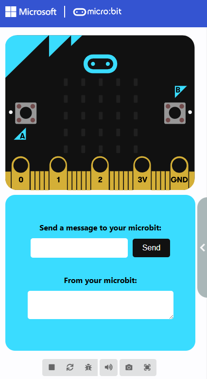

# Simulator Extension Sample

## What is a simulator extension?

A simulator extension (referred to as _simx_) is a static web application that complements a traditional MakeCode extension. When you add an extension containing a _simx_ to your MakeCode project, the simulator extension is loaded into a separate iframe within the MakeCode editor:

Simulator extensions are implemented as part of a standard MakeCode extension, but are organized as a separate project in a subfolder. This keeps them distinct from the main extension’s code.

## Creating a simulator extension

The easiest way to create a simulator extension is to fork this repository and then modify it to fit your needs.

See [./simx/README.md](./simx/README.md) for detailed instructions.

---
# README
What follows is the default README common to all MakeCode extensions.

> Open this page at [https://eanders-ms.github.io/simx-sample/](https://eanders-ms.github.io/simx-sample/)

## Use as Extension

This repository can be added as an **extension** in MakeCode.

* open [https://makecode.microbit.org/](https://makecode.microbit.org/)
* click on **New Project**
* click on **Extensions** under the gearwheel menu
* search for **https://github.com/eanders-ms/simx-sample** and import

## Edit this project

To edit this repository in MakeCode.

* open [https://makecode.microbit.org/](https://makecode.microbit.org/)
* click on **Import** then click on **Import URL**
* paste **https://github.com/eanders-ms/simx-sample** and click import

#### Metadata (used for search, rendering)

* for PXT/microbit

